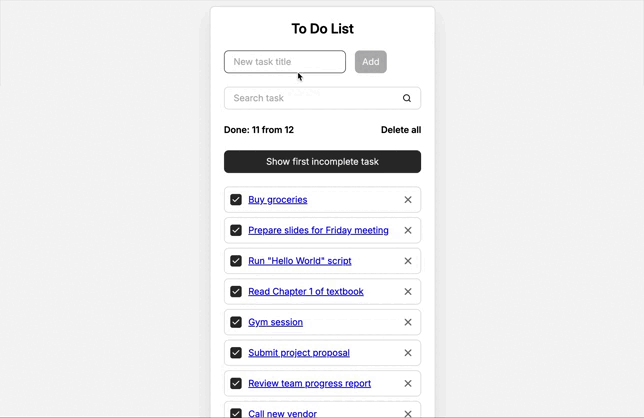

# To-Do List React

---

Минималистичный и производительный менеджер задач на React с фокусом на оптимизации и UX.



---

## Содержание

- [О проекте](#о-проекте)
- [Инструменты](#инструменты-и-практики)
- [Системные требования](#системные-требования)
- [Начало работы](#начало-работы)
- [Структура проекта](#структура-проекта)
- [Контакты](#контакты)

---

## О проекте

### Ключевые функции

1. Добавление новых задач с автоматическим сохранением.
2. Поиск задач по названию (независимо от регистра).
3. Автоматический скролл к первой невыполненной задаче по кнопке.
4. Отметка задач как выполненных и удаление отдельных задач.
5. Полное удаление всех задач.
6. Детальные страницы для каждой задачи с роутингом.
7. Персистентность данных в LocalStorage и синхронизация с API (json-server).
8. Анимации для плавного UX и защита от XSS-атак.

### Технологический стек

#### Frontend

React (JSX) + Vite (быстрый сборщик).  
Модульные стили (CSS Modules).  
React Router для навигации по задачам.

#### State Management & Optimization

useState, useEffect, useMemo, useCallback, memo.
useReducer для сложной логики задач.
useContext (против prop drilling).
Кастомные хуки: useTasks, useLocalStorage, useIncompleteTaskScroll.

---

## Инструменты и практики

Git + Git Flow методология.  
API - интеграция с json-server.  
Анимации CSS.  
Архитектура: Feature-Sliced Design (FSD) — проект переписан для масштабируемости.  
Защита от Cross-Site Scripting.

---

## Начало работы

### Системные требования

Node.js 18+

### Установка

```
git clone https://github.com/Georgy-dev/To-Do-List-React
```

```
cd react-todo
```

```
npm install
```

### Запуск

#### Для dev-сервера

```
npm run dev
```

#### Для json-server (API)

```
npm run server
```

Open http://localhost:5173

---

## Структура проекта

Проект построен по Feature-Sliced Design методологии для удобной навигации и масштабирования:

src/
├── app/
├── pages/
├── widgets/
├── features/
├── entities/
├── shared/
└── main.jsx

---

## Контакты

Автор: Георгий Агеев.

GitHub: https://github.com/Georgy-dev.

Telegram: [@GeorgeFrontDev](https://t.me/GeorgeFrontDev).
